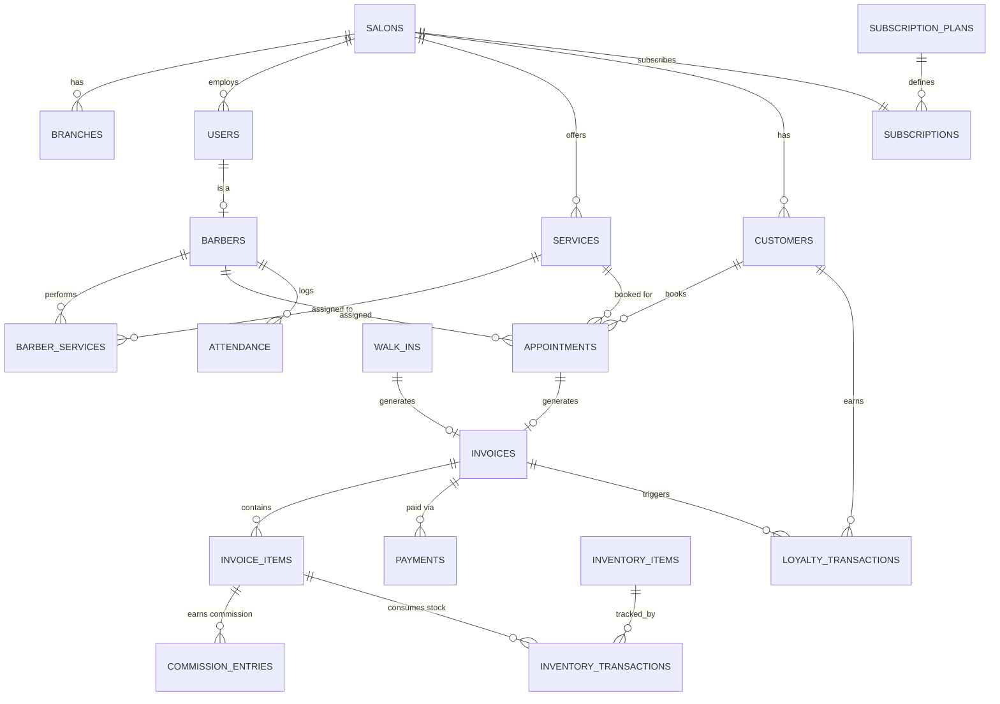

# Database Schema & ER Diagram
## Salon SaaS Management Platform

**Version:** 1.0
**Database:** PostgreSQL
**ORM:** Prisma

---

## 1. Multi-Tenancy Model

Single shared schema. Every tenant-scoped table carries a `salon_id` foreign key referencing `salons.id`. Multi-branch accounts additionally carry a `branch_id` referencing `branches.id`. PostgreSQL Row-Level Security (RLS) policies should be enabled on every tenant-scoped table, restricting visibility to the `salon_id` set in the current session/connection context — a database-level backstop behind the application-level tenant filter described in the TRD.

---

## 2. Schema Conventions

- Primary keys: UUID (`gen_random_uuid()`), not auto-increment integers — avoids leaking record counts and simplifies future data migration/merging.
- Every table has `created_at` and `updated_at` timestamps (UTC).
- Soft deletes via `deleted_at` (nullable) on tables with regulatory/financial relevance (invoices, payments, appointments) rather than hard deletes.
- Money stored as integer paise (smallest currency unit) to avoid floating-point rounding errors, displayed as ₹ in the UI.
- Enum-like fields implemented as Postgres enums or constrained varchar with a check constraint (`status`, `role`, `salary_type`, etc.).

---

## 3. Core Tables

### 3.1 `salons` (tenant root)
| Column | Type | Notes |
|---|---|---|
| id | uuid PK | |
| name | varchar | |
| owner_name | varchar | |
| phone | varchar | unique |
| gst_number | varchar | nullable |
| address | text | |
| city | varchar | |
| state | varchar | |
| logo_url | varchar | nullable |
| status | enum | pending, active, suspended |
| subscription_id | uuid FK → subscriptions.id | nullable until plan chosen |
| created_at / updated_at | timestamp | |

### 3.2 `branches`
| Column | Type | Notes |
|---|---|---|
| id | uuid PK | |
| salon_id | uuid FK → salons.id | |
| name | varchar | |
| address | text | |
| is_primary | boolean | |
| created_at / updated_at | timestamp | |

### 3.3 `users`
| Column | Type | Notes |
|---|---|---|
| id | uuid PK | |
| salon_id | uuid FK → salons.id | nullable for super_admin |
| branch_id | uuid FK → branches.id | nullable |
| role | enum | super_admin, owner, staff |
| name | varchar | |
| email | varchar | unique, nullable |
| phone | varchar | unique, nullable |
| password_hash | varchar | nullable if phone-only login |
| status | enum | active, inactive |
| last_login_at | timestamp | nullable |
| created_at / updated_at | timestamp | |

### 3.4 `barbers` (staff profile extension, 1:1 with a `users` row of role=staff)
| Column | Type | Notes |
|---|---|---|
| id | uuid PK | |
| user_id | uuid FK → users.id | unique |
| salon_id | uuid FK → salons.id | |
| branch_id | uuid FK → branches.id | |
| joining_date | date | |
| salary_type | enum | fixed, commission, hybrid |
| commission_percent | decimal(5,2) | nullable |
| status | enum | active, inactive |

### 3.5 `service_categories`
| Column | Type | Notes |
|---|---|---|
| id | uuid PK | |
| salon_id | uuid FK → salons.id | |
| name | varchar | e.g., Hair, Skin, Spa |

### 3.6 `services`
| Column | Type | Notes |
|---|---|---|
| id | uuid PK | |
| salon_id | uuid FK → salons.id | |
| category_id | uuid FK → service_categories.id | |
| name | varchar | |
| duration_minutes | int | |
| price_paise | bigint | |
| tax_percent | decimal(5,2) | |
| status | enum | active, inactive |

### 3.7 `barber_services` (skill mapping, many-to-many)
| Column | Type | Notes |
|---|---|---|
| barber_id | uuid FK → barbers.id | composite PK |
| service_id | uuid FK → services.id | composite PK |

### 3.8 `customers`
| Column | Type | Notes |
|---|---|---|
| id | uuid PK | |
| salon_id | uuid FK → salons.id | |
| name | varchar | |
| mobile | varchar | unique per salon_id |
| birthday | date | nullable |
| anniversary | date | nullable |
| preferred_barber_id | uuid FK → barbers.id | nullable |
| total_spend_paise | bigint | denormalized, updated on invoice paid |
| loyalty_points | int | denormalized, updated via loyalty_transactions |
| created_at / updated_at | timestamp | |

### 3.9 `appointments`
| Column | Type | Notes |
|---|---|---|
| id | uuid PK | |
| salon_id | uuid FK → salons.id | |
| branch_id | uuid FK → branches.id | |
| customer_id | uuid FK → customers.id | nullable (can be set at check-in) |
| barber_id | uuid FK → barbers.id | |
| service_id | uuid FK → services.id | |
| scheduled_start | timestamp | |
| scheduled_end | timestamp | derived from service duration |
| status | enum | scheduled, confirmed, in_progress, completed, cancelled |
| created_by | uuid FK → users.id | |
| created_at / updated_at | timestamp | |

*Constraint: no two appointments for the same `barber_id` may have overlapping `[scheduled_start, scheduled_end)` ranges while status is not `cancelled`.*

### 3.10 `walk_ins`
| Column | Type | Notes |
|---|---|---|
| id | uuid PK | |
| salon_id | uuid FK → salons.id | |
| branch_id | uuid FK → branches.id | |
| customer_id | uuid FK → customers.id | nullable |
| barber_id | uuid FK → barbers.id | |
| invoice_id | uuid FK → invoices.id | set once billed |
| created_at | timestamp | |

### 3.11 `invoices`
| Column | Type | Notes |
|---|---|---|
| id | uuid PK | |
| salon_id | uuid FK → salons.id | |
| branch_id | uuid FK → branches.id | |
| customer_id | uuid FK → customers.id | nullable |
| appointment_id | uuid FK → appointments.id | nullable |
| walk_in_id | uuid FK → walk_ins.id | nullable |
| subtotal_paise | bigint | |
| tax_paise | bigint | |
| total_paise | bigint | |
| status | enum | draft, paid, void |
| gst_invoice_number | varchar | nullable |
| created_at / updated_at | timestamp | |

### 3.12 `invoice_items`
| Column | Type | Notes |
|---|---|---|
| id | uuid PK | |
| invoice_id | uuid FK → invoices.id | |
| service_id | uuid FK → services.id | nullable |
| inventory_item_id | uuid FK → inventory_items.id | nullable (product sale) |
| barber_id | uuid FK → barbers.id | for commission attribution |
| description | varchar | |
| quantity | int | |
| unit_price_paise | bigint | |
| tax_percent | decimal(5,2) | |

### 3.13 `payments`
| Column | Type | Notes |
|---|---|---|
| id | uuid PK | |
| invoice_id | uuid FK → invoices.id | |
| method | enum | cash, upi, card, wallet |
| amount_paise | bigint | |
| razorpay_payment_id | varchar | nullable, unique |
| status | enum | initiated, captured, failed, refunded |
| created_at | timestamp | |

### 3.14 `expense_categories`
| Column | Type | Notes |
|---|---|---|
| id | uuid PK | |
| salon_id | uuid FK → salons.id | |
| name | varchar | rent, electricity, water, salary, inventory, marketing, other |

### 3.15 `expenses`
| Column | Type | Notes |
|---|---|---|
| id | uuid PK | |
| salon_id | uuid FK → salons.id | |
| branch_id | uuid FK → branches.id | |
| category_id | uuid FK → expense_categories.id | |
| amount_paise | bigint | |
| note | text | nullable |
| spent_on | date | |
| created_by | uuid FK → users.id | |
| created_at | timestamp | |

### 3.16 `inventory_items`
| Column | Type | Notes |
|---|---|---|
| id | uuid PK | |
| salon_id | uuid FK → salons.id | |
| branch_id | uuid FK → branches.id | |
| name | varchar | e.g., Shampoo, Hair Gel, Wax |
| unit | varchar | e.g., ml, pcs |
| current_stock | decimal | |
| low_stock_threshold | decimal | |
| created_at / updated_at | timestamp | |

### 3.17 `inventory_transactions`
| Column | Type | Notes |
|---|---|---|
| id | uuid PK | |
| inventory_item_id | uuid FK → inventory_items.id | |
| type | enum | stock_in, stock_out |
| quantity | decimal | |
| reference_invoice_item_id | uuid FK → invoice_items.id | nullable, links stock-out to a sale |
| created_by | uuid FK → users.id | |
| created_at | timestamp | |

### 3.18 `attendance`
| Column | Type | Notes |
|---|---|---|
| id | uuid PK | |
| barber_id | uuid FK → barbers.id | |
| clock_in_at | timestamp | |
| clock_out_at | timestamp | nullable |
| date | date | denormalized for fast daily/monthly queries |

### 3.19 `commission_entries`
| Column | Type | Notes |
|---|---|---|
| id | uuid PK | |
| barber_id | uuid FK → barbers.id | |
| invoice_item_id | uuid FK → invoice_items.id | |
| commission_amount_paise | bigint | computed at invoice time from barber's commission_percent |
| period | varchar | e.g., "2026-06" for fast monthly rollups |
| created_at | timestamp | |

### 3.20 `loyalty_transactions`
| Column | Type | Notes |
|---|---|---|
| id | uuid PK | |
| customer_id | uuid FK → customers.id | |
| invoice_id | uuid FK → invoices.id | nullable |
| points | int | positive = earned, negative = redeemed |
| reason | varchar | "earn", "redeem", "manual_adjustment" |
| created_at | timestamp | |

### 3.21 `subscription_plans`
| Column | Type | Notes |
|---|---|---|
| id | uuid PK | |
| name | varchar | Basic, Professional, Enterprise |
| staff_limit | int | nullable = unlimited |
| branch_limit | int | nullable = unlimited |
| features | jsonb | feature flags: inventory, analytics, ai, multi_branch, priority_support |
| price_paise_monthly | bigint | |

### 3.22 `subscriptions`
| Column | Type | Notes |
|---|---|---|
| id | uuid PK | |
| salon_id | uuid FK → salons.id | |
| plan_id | uuid FK → subscription_plans.id | |
| status | enum | trialing, active, past_due, cancelled |
| current_period_end | timestamp | |
| created_at / updated_at | timestamp | |

### 3.23 `notification_preferences`
| Column | Type | Notes |
|---|---|---|
| id | uuid PK | |
| salon_id | uuid FK → salons.id | |
| channel | enum | push, sms, whatsapp, email |
| event_type | varchar | daily_summary, low_stock, staff_absent, appointment_reminder, birthday, loyalty_offer |
| enabled | boolean | |

### 3.24 `audit_logs`
| Column | Type | Notes |
|---|---|---|
| id | uuid PK | |
| salon_id | uuid FK → salons.id | nullable for platform-level actions |
| actor_user_id | uuid FK → users.id | |
| action | varchar | e.g., "staff.deleted", "subscription.changed" |
| metadata | jsonb | |
| created_at | timestamp | |

---

## 4. Relationships Summary

- One `salon` → many `branches`, `users`, `services`, `customers`, `appointments`, `invoices`, `expenses`, `inventory_items`.
- One `user` (role=staff) → one `barber` profile.
- One `barber` → many `appointments`, `attendance` records, `commission_entries`.
- One `appointment` or `walk_in` → exactly one `invoice` once completed/billed.
- One `invoice` → many `invoice_items` → many `payments` (supports split payment).
- One `customer` → many `appointments`, `invoices`, `loyalty_transactions`.
- One `subscription_plan` → many `subscriptions` → one per `salon` (current).

---

## 5. Entity-Relationship Diagram



---

## 6. Indexing Strategy

- Composite index on every tenant-scoped table: `(salon_id, created_at)` for recency-ordered listing queries.
- `appointments`: index on `(barber_id, scheduled_start, scheduled_end)` for the overlap-prevention check and calendar views.
- `customers`: unique composite index on `(salon_id, mobile)`.
- `invoices`: index on `(salon_id, status, created_at)` for dashboard revenue queries.
- `inventory_transactions` and `commission_entries`: index on `(period)` / created_at for fast monthly rollups.
- `audit_logs`: index on `(salon_id, created_at)` for support lookups.

---

## 7. Row-Level Security (example policy)

```sql
ALTER TABLE invoices ENABLE ROW LEVEL SECURITY;

CREATE POLICY tenant_isolation_invoices ON invoices
  USING (salon_id = current_setting('app.current_salon_id')::uuid);
```

The application sets `app.current_salon_id` at the start of each request transaction based on the authenticated JWT's `salon_id` claim. Super Admin connections use a separate role that bypasses RLS for platform-wide queries, audited via `audit_logs`.

---

## 8. Multi-Branch Considerations

- `branch_id` is nullable on most operational tables to support single-branch salons cleanly (treated as one implicit branch) while allowing Enterprise-tier accounts to scope staff, inventory, and reporting per branch.
- Cross-branch analytics queries aggregate by `salon_id` while branch-level dashboards filter additionally by `branch_id`.

---

*See 04-architecture.md for how this data model is deployed and accessed at scale.*
