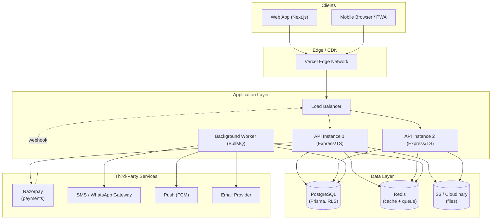
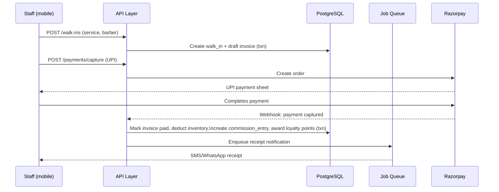
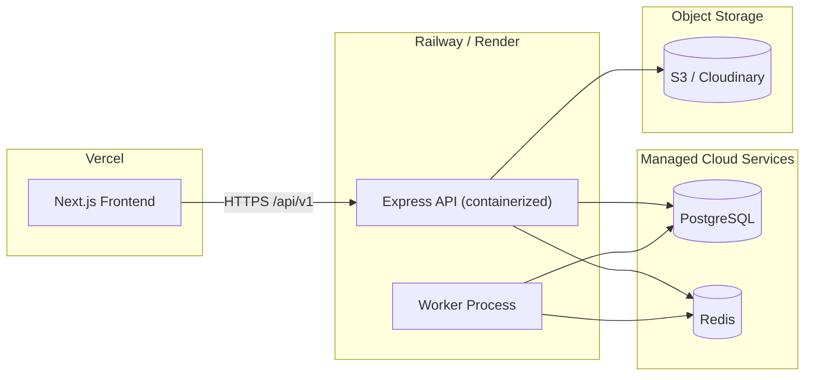

# SaaS Architecture & System Design
## Salon SaaS Management Platform

**Version:** 1.0
**Companion to:** 01-PRD.md, 02-TRD.md, 03-database-schema.md

---

## 1. Architecture Style

**Modular monolith** for the API layer, **separate static/SSR frontend**, fronted by a load balancer. Modules (auth, salons, staff, services, customers, appointments, billing, inventory, reports, notifications, subscriptions) are organized as independent folders/packages with explicit interfaces, so any module can later be extracted into its own service without a data-model rewrite — see Section 11.

This is chosen over microservices for the current stage because the team is small, transaction volume per tenant is modest, and a monolith keeps cross-module transactions (e.g., "complete appointment → create invoice → update inventory → award loyalty points" in one DB transaction) simple and consistent.

---

## 2. High-Level Architecture

---

## 3. Multi-Tenant Architecture

All tenants (salons) share the same application instances and database, isolated logically:

- **Application layer:** every authenticated request carries a `salon_id` resolved from the JWT; all Prisma queries are wrapped by a repository layer that auto-injects the tenant filter, making it structurally difficult for a developer to write a query that accidentally spans tenants.
- **Database layer:** PostgreSQL Row-Level Security policies (see 03-database-schema.md, Section 7) enforce isolation even if an application-layer filter is missed.
- **Cache layer:** Redis keys are namespaced `salon:{id}:...` so cache reads/writes cannot cross tenants.
- **Super Admin:** operates through a distinct, more heavily audited code path with platform-wide read access, used for support and analytics — every such access is written to `audit_logs`.

---

## 4. Request Lifecycle (example: complete a walk-in sale)

---

## 5. Component Breakdown

| Component | Responsibility |
|---|---|
| Load Balancer | TLS termination, routes to healthy API instances |
| API Instances | Stateless Express/TS processes; horizontally scaled |
| Background Worker | Processes queued jobs: notifications, scheduled reports, reminders |
| PostgreSQL | System of record; RLS-enforced tenant isolation |
| Redis | Hot-path cache (dashboard aggregates) + job queue backend |
| Object Storage | Logos, photos, generated report files |
| Razorpay | Payment processing, PCI scope isolation |
| Notification Gateways | Pluggable adapters for SMS/WhatsApp/Push/Email |

---

## 6. Deployment Architecture

Each environment (staging, production) is a fully isolated stack: separate Vercel project, separate Railway/Render service, separate database instance and credentials.

---

## 7. Scaling Strategy

- **API tier:** stateless instances scale horizontally behind the load balancer based on CPU/connection metrics.
- **Database:** vertical scaling first (managed Postgres tiers), read replicas introduced for reporting/analytics queries once a single primary becomes a bottleneck, connection pooling via PgBouncer to handle many short tenant requests.
- **Background jobs:** worker count scales independently of API instance count since notification/report volume doesn't track 1:1 with request volume.
- **Hot tenants:** the data model supports moving a single very large Enterprise tenant to a dedicated database later without changing application code, only its connection routing.

---

## 8. Disaster Recovery & Backups

- Automated daily PostgreSQL backups with point-in-time recovery (managed provider feature).
- Object storage versioning enabled for accidental overwrite/delete recovery.
- Redis treated as ephemeral (cache + queue) — no business data is durable only in Redis; queue jobs are re-creatable from source-of-truth tables if lost.
- Documented RTO/RPO targets should be set with the chosen managed-database provider's SLA once selected.

---

## 9. Multi-Branch Architecture

Multi-branch salons (Enterprise tier) use the same single-tenant-id model with an additional `branch_id` scope:
- Staff, inventory, and attendance are branch-scoped by default.
- Billing/customers can be shared account-wide or branch-scoped depending on the salon's preference (configurable at onboarding).
- The Earnings/Analytics dashboard adds a branch selector and a "combined" view that aggregates across all branches under one `salon_id`.

---

## 10. Security Architecture

- **AuthN/AuthZ:** JWT + RBAC, enforced in middleware before any handler runs (see TRD Section 5).
- **Tenant isolation:** application filter + Postgres RLS, defense in depth (see Section 3 above).
- **Transport security:** TLS everywhere, HSTS, secure cookie flags for any cookie-based session data.
- **Secrets management:** environment-injected secrets via the hosting platform's secret manager; never in source control.
- **Payment security:** card/UPI details never touch platform servers — Razorpay Checkout handles PCI-scoped data entirely.
- **Audit trail:** sensitive mutations (staff deletion, role changes, subscription changes, salon suspension, Super Admin cross-tenant access) write to `audit_logs`.
- **Rate limiting:** applied at the load balancer/API gateway level on auth and OTP endpoints to mitigate brute-force and SMS-bombing abuse.

---

## 11. Future Microservices Migration Path

If/when specific modules need independent scaling or release cadence, the modular-monolith boundaries map directly onto candidate services, roughly in this order of likely extraction:

1. **Notifications service** — highest job volume, independent of core transactional path, easiest to extract first.
2. **Reporting/Analytics service** — read-heavy, benefits from its own read replica and possibly a different storage shape (e.g., a columnar store) without touching the OLTP path.
3. **AI/Insights service** — premium-tier feature with different compute profile (batch/ML workloads) than the rest of the API.
4. **Billing/Payments service** — isolating PCI-adjacent code paths and webhook handling for tighter security boundaries as transaction volume grows.

Core entities (salons, users, appointments, invoices) remain in the primary service the longest, since they're the most transactionally coupled.

---

*This completes the planning document set: 01-PRD.md (what to build), 02-TRD.md (how to build it), 03-database-schema.md (data model), 04-architecture.md (system design). Recommended next step: scaffold the folder structure and core auth/tenant module from the TRD.*
